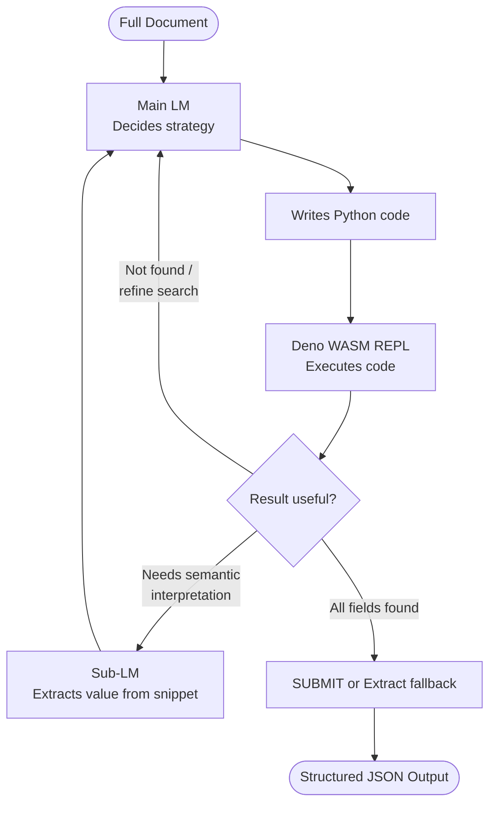
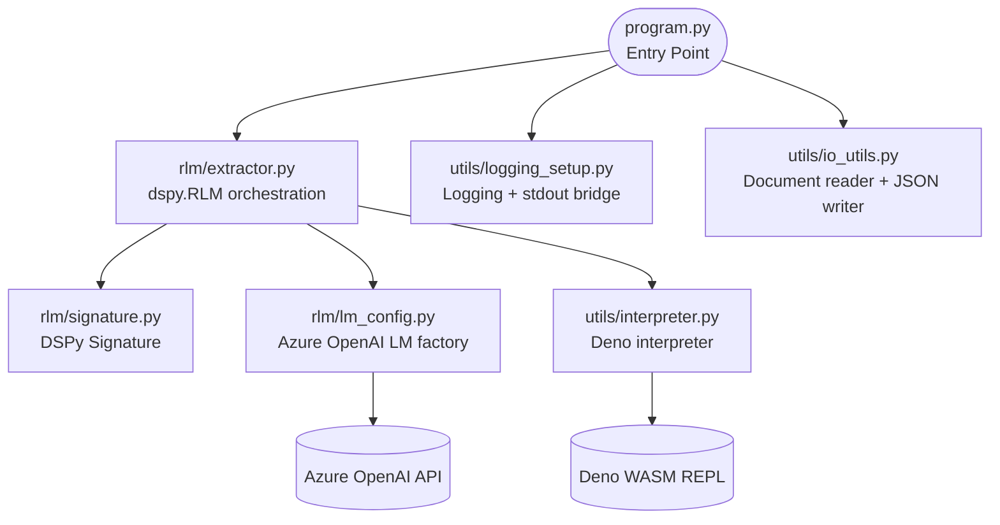
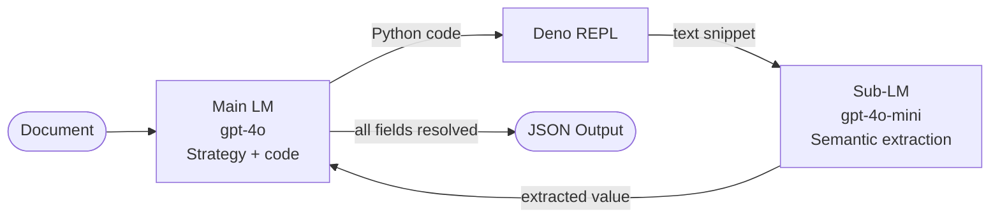

# DSPy RLM: Recursive Language Model for Document Extraction

A practical demonstration of **DSPy RLM (Recursive Language Model)** for extracting structured information from large, complex documents using Python and Azure OpenAI.

This project showcases how RLM can intelligently search and reason over full documents without pre-chunking, using its built-in Python REPL to iteratively locate and extract information.

---

## What is DSPy RLM?

DSPy RLM is a language model that uses recursive reasoning with a Python REPL environment. Instead of chunking and summarizing documents upfront, RLM:

1. **Receives the full document** in one pass
2. **Writes and executes Python code** in a sandboxed REPL to search the document
3. **Iteratively refines** its searches based on results
4. **Extracts structured outputs** once confident

This approach eliminates information loss from chunking and allows the model to dynamically adapt its extraction strategy.



---

## Features

- Windows-compatible Deno interpreter setup (no npm wrappers needed)
- Configurable main LM and optional cheaper sub-LM for semantic extraction
- Comprehensive logging with console + timestamped file output
- Verbose RLM trajectory tracking (see exactly what reasoning steps the model took)
- Extraction results saved as structured JSON in `outputs/`
- Two PDF-to-Markdown converters included (fast and ML-quality)
- Full Azure OpenAI integration with environment-based configuration

---

## Quick Start

### 1. Clone the Repository

```bash
git clone <repo-url>
cd PuG-DevCon-2026
```

### 2. Create and Activate Virtual Environment

**On Windows (PowerShell):**
```powershell
python -m venv venv
.\venv\Scripts\Activate.ps1
```

**On Windows (CMD):**
```cmd
python -m venv venv
venv\Scripts\activate.bat
```

**On macOS/Linux:**
```bash
python -m venv venv
source venv/bin/activate
```

### 3. Install Dependencies

```bash
pip install -r requirements.txt
```

### 4. Configure Azure OpenAI

Copy the example environment file:
```bash
cp .env.example .env
```

Edit `.env` and fill in your Azure OpenAI credentials:
```
AZURE_OPENAI_DEPLOYMENT=your_deployment_name
AZURE_OPENAI_API_KEY=your_api_key_here
AZURE_OPENAI_ENDPOINT=https://your_resource_name.openai.azure.com/
AZURE_OPENAI_API_VERSION=2024-10-21

# Optional: Use a cheaper model for sub-LM (semantic extraction)
AZURE_OPENAI_SUB_LM_DEPLOYMENT=gpt-4o-mini
```

### 5. Prepare Your Document

Two converters are available in `converters/`. Use the one that suits your document:

**Option A — Fast converter** (`pymupdf4llm`, position-based, good for text-heavy PDFs):
```bash
python converters/convert_pdf_to_md.py "path/to/document.pdf" data/document.md
```

**Option B — ML-quality converter** (`docling`, RT-DETR table recognition, recommended for PDFs with complex tables):
```bash
python converters/convert_pdf_to_md_docling.py "path/to/document.pdf" data/document.md
```

For very large PDFs (200+ pages) the docling converter automatically chunks the document to avoid out-of-memory errors. You can tune the chunk size:
```bash
python converters/convert_pdf_to_md_docling.py "path/to/document.pdf" data/document.md --chunk-size 5
```

Or place your existing markdown file directly in the `data/` folder and update `REPORT_PATH` in [program.py](program.py#L28):
```python
REPORT_PATH = Path(__file__).parent / "data" / "your_document.md"
```

### 6. Run the Extraction

```bash
python program.py
```

**Output:**
- Console output with extracted fields and RLM trajectory
- Timestamped log file: `logs/run_YYYYMMDD_HHMMSS.log`
- Structured JSON result: `outputs/result_YYYYMMDD_HHMMSS.json`

---

## Project Structure

```
.
├── program.py                        # Entry point — RLM call and result logging
├── rlm/
│   ├── signature.py                  # DSPy Signature: defines fields to extract
│   ├── lm_config.py                  # Azure OpenAI LM factory (main + sub-LM)
│   └── extractor.py                  # Wires up dspy.RLM and runs extraction
├── utils/
│   ├── logging_setup.py              # Console + file logging, RLM stdout bridge
│   ├── interpreter.py                # Windows-compatible Deno interpreter factory
│   └── io_utils.py                   # Document reader and JSON output writer
├── converters/
│   ├── convert_pdf_to_md.py          # Fast PDF converter (pymupdf4llm)
│   └── convert_pdf_to_md_docling.py  # ML-quality PDF converter (docling, OOM-safe)
├── data/                             # Place your markdown documents here
├── logs/                             # Auto-created; timestamped execution logs
├── outputs/                          # Auto-created; timestamped JSON results
├── requirements.txt
├── .env.example
└── README.md
```



---

## Customizing the Extraction

Edit `ExtractReportFields` in [rlm/signature.py](rlm/signature.py) to define the fields you want to extract:

```python
class ExtractReportFields(dspy.Signature):
    """Extract key fields from a document."""

    document: str = dspy.InputField(desc="Full markdown text of the document")

    # Add your own fields here
    field_name: str = dspy.OutputField(desc="Description of what to extract")
    another_field: str = dspy.OutputField(desc="Another piece of information")
```

Then update the logging block in [program.py](program.py) `main()` to print your new field names.

---

## Configuration Options

### Main LM vs Sub-LM

The **main LM** drives the overall extraction strategy (deciding what to search for, what code to run).  
The **sub-LM** handles semantic queries inside the REPL loop (extracting specific values from snippets already found).

Using a cheaper model for sub-LM (e.g., `gpt-4o-mini`) significantly reduces costs on large documents without sacrificing quality.



### RLM Parameters

Adjust RLM behavior in [rlm/extractor.py](rlm/extractor.py):

```python
rlm = dspy.RLM(
    ExtractReportFields,
    interpreter=interpreter,
    tools=[],
    sub_lm=sub_lm,
    max_iterations=20,      # default: 20 (max reasoning loops)
    max_llm_calls=50,       # default: 50 (max LLM queries)
    verbose=True,           # Show RLM's reasoning in logs
)
```

---

## Understanding the Output

### Extracted Fields
The console displays the final extracted values:
```
Survey edition        : Economic Survey 2025-26
Real GDP growth       : 6.4%
...
```

### RLM Trajectory
The log file contains the full reasoning path — every code snippet RLM wrote and every result it got back:
```
--- Step 1 ---
Reasoning : I need to find the GDP growth rate. I'll search for 'GDP' in the document.
Code      :
    idx = document.find('GDP')
    print(document[idx:idx+500])

Output    : Real GDP growth rate of 6.4 per cent...
```

### JSON Result
Each run writes `outputs/result_YYYYMMDD_HHMMSS.json`:
```json
{
  "timestamp": "2026-04-11T23:29:57",
  "document": "data/document-2.md",
  "fields": {
    "survey_edition": "Economic Survey 2025-26",
    "real_gdp_growth": "6.4%",
    ...
  }
}
```

---

## Requirements

- Python 3.8+
- Azure OpenAI access (API key + deployment)
- Deno installed (for REPL execution)
  - On Windows: `winget install denoland.deno` or visit [deno.land](https://deno.land)
  - On macOS: `brew install deno`
  - On Linux: `curl -fsSL https://deno.land/install.sh | sh`

---

## Troubleshooting

### "Deno not found"
If the interpreter can't find Deno, verify your installation:
```bash
deno --version
```

The script checks these locations (in order):
- `%USERPROFILE%\.deno\bin\deno.exe`
- `C:\deno\deno.exe`
- `%APPDATA%\npm\node_modules\deno\deno.exe`

### Out-of-memory errors during PDF conversion
Use `convert_pdf_to_md_docling.py` with a smaller chunk size:
```bash
python converters/convert_pdf_to_md_docling.py document.pdf data/document.md --chunk-size 3
```
The converter automatically falls back to page-by-page processing if a chunk fails.

### "pymupdf4llm / docling import error"
Install the PDF converter dependencies:
```bash
pip install pymupdf4llm docling
```

### Azure OpenAI errors
Check your `.env` file:
- Verify `AZURE_OPENAI_ENDPOINT` includes the trailing slash
- Confirm `AZURE_OPENAI_DEPLOYMENT` matches your actual deployment name
- Test credentials with Azure CLI:
  ```bash
  az login
  az account show
  ```

---

## Learning Resources

- **DSPy Documentation**: https://github.com/stanfordnlp/dspy
- **Azure OpenAI**: https://azure.microsoft.com/en-us/products/openai/
- **Deno Documentation**: https://docs.deno.com/

---

## License

This project is provided as-is for educational and experimental purposes.

---

## Contributing

Contributions, issues, and feature requests are welcome! Feel free to fork and experiment.

